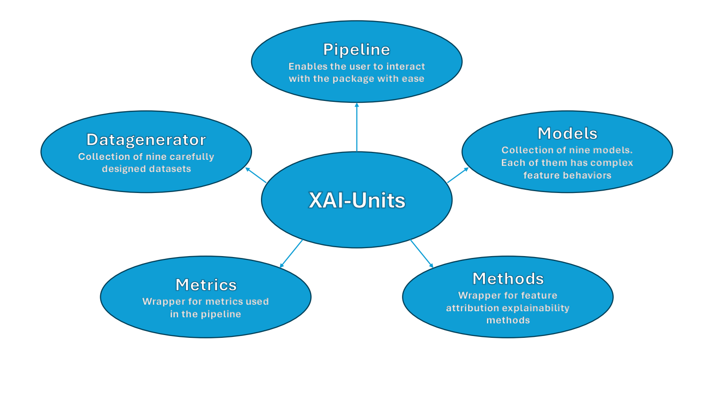

# Overview

<!-- <a>Documentation</a> -->

Welcome to the XAI-Units package repository! This is a library to help benchmark and compare explainable AI feature attribution methods. It contains a collection of datasets and models with specific units of behaviour that are known to be challenging for feature attribution methods. The library also contains an end-to-end pipeline for applying feature attribution methods across a range of datasets/models, scoring them with metrics, then summarising the results.

Please also visit our [documentation page](https://xai-units.github.io/xaiunits_public/.) for additional references.



## Table of Contents

- [Overview](#overview)
	- [Table of Contents](#table-of-contents)
	- [Project structure](#project-structure)
	- [Installation Guide](#installation-guide)
	- [Examples](#example)
	- [Getting started](#getting-started)
	- [Further Resources](#further-resources)
		- [Tutorials](#tutorials)
		- [Documentation](#documentation)
	- [Current Features](#current-features)
		- [Datasets](#datasets)
		- [Models](#models)
		- [Methods](#methods)
		- [Metrics](#metrics)
		- [Pipeline](#pipeline)
		- [Trainer](#trainer)

## Project structure

```python
├── data\dinosaur_images
├── demo
│   ├── tutorials
│	└── Example
├── docs
└── src\xaiunits
    ├── datagenerator
    ├── methods
    ├── metrics
    ├── model
    ├── pipeline
    └── trainer

```

## Installation Guide

1. Clone the repo.
2. Create a virtual environment.
	* `python -m venv ./venv`
3. Activate the virtual environment then navigate to the root of the repo.
4. Use the requirements.txt file to pip install the requirements.
	* `pip install -r requirements.txt`
5. You may wish to upgrade the installed version of pytorch for GPU support. (Official benchmark models were trained on pytorch-cuda=12.1).
6. Install this library as a local editable package. Note the full stop . at the end of the command refers to the current directory i.e. the root of the repo
	* `pip install -e .`

## Example

This folder contains real world example of experiments using our library that reader can reference. Follow the steps below:

1. Step 1: Follow the installation guide above so you have an active venv with the required packages installed.
2. Step 2: Change the root folder to demo/example folder to ensure that relative file paths are intact, `cd ./demo/example`
3. Step 3: select the appropriate Python script to reproduce experiment of choice (e.g. `python3 tabular.py`)
	* Tabular Experiment : [tabular.py](/demo/examples/tabular.py)
	* DeepLIFT Supplementary Experiment : [deeplift_suppl_exp.py](/demo/examples/deeplift_suppl_exp.py)
	* Image Experiment CNN : [image.py](/demo/examples/image.py)
	* Image Experiment ViT : [image.py](/demo/examples/image_vit.py)
	* Image Experiment Text : [image.py](/demo/examples/text.py)

## Getting started

Here, we present a practical, end-to-end example that demonstrates how to effectively utilize one of the library's features.
The Pipeline is one of the main features of the library, bringing a simple, straightforward way to write
end-to-end experiments with feature attribution explainability methods.

Necessary imports to run this code:

```python
from xaiunits.model import ContinuousFeaturesNN
from xaiunits.datagenerator import WeightedFeaturesDataset
from captum.metrics import sensitivity_max, infidelity
from captum.attr import InputXGradient, IntegratedGradients, Lime
from xaiunits.pipeline import Pipeline
from xaiunits.metrics import perturb_standard_normal, wrap_metric
```

Select one of the multiple datasets in the library

```python
dataset = WeightedFeaturesDataset()
```

Select a model compatible with the dataset

```python
model = ContinuousFeaturesNN(n_features=dataset.n_features, weights=dataset.weights)
# alternatively use model = dataset.generate_model()
```

Add explainability methods of your choice to the list

```python
methods = [InputXGradient, IntegratedGradients, Lime]
```

Add the metrics you want to use to the list, using wrap_metric

```python
metrics = [
    wrap_metric(sensitivity_max),
    wrap_metric(infidelity, perturb_func=dataset.perturb_function(), normalize=True),
] 
```

You can add as many models as you want to the list for the Pipeline to run

```python
models = [model] 
```

Add as many datasets as you want to the list. Make sure models and datasets are compatible with each other

```python
datasets = [dataset]
```

Create the pipeline

```python
pipeline = Pipeline(models, datasets, methods, metrics, method_seeds=[10])
```

Use the features of the Pipeline

```python
results = pipeline.run() # apply the explanation methods and evaluate them
results.print_stats() # print results of the explainability methods and the metrics
df = results.data # access the full dataframe of results
```

## Further Resources

To expand more on the usage of models, datasets, methods, and metrics available, as well as other features the library has, such as the Autotrainer and the ExperimentPipeline, refer to the `demo/tutorials` folder and to the documentation.

### Tutorials

[library_quickstart.ipynb](/demo/tutorials/library_quickstart.ipynb)

[custom_methods_and_custom_datasets.ipynb](/demo/tutorials/custom_methods_and_custom_datasets.ipynb)

[dataset_reading.ipynb](/demo/tutorials/dataset_reading.ipynb)

[image_dataset_example.ipynb](/demo/tutorials/image_dataset_example.ipynb)

### Documentation

The documentation uses Sphinx. For a local build of the documentation, ensure that `requirements.txt` has been installed (including Sphinx) then navigate to the `docs` folder and run the following command:

```bash
make html
```

Then access the documentation by opening the file `docs/_build/html/index.html`.

## Current Features

### Datasets

- WeightedFeaturesDataset: [data_generation.py](/src/xaiunits/datagenerator/data_generation.py)
- ConflictingDataset: [conflicting.py](/src/xaiunits/datagenerator/conflicting.py)
- PertinentNegativesDataset: [pertinent_negatives.py](/src/xaiunits/datagenerator/pertinent_negatives.py)
- ShatteredGradientsDataset: [shattered_grad.py](/src/xaiunits/datagenerator/shattered_grad.py)
- InteractingFeatureDataset: [interacting_features.py](/src/xaiunits/datagenerator/interacting_features.py)
- UncertaintyAwareDataset: [uncertainty_aware.py](/src/xaiunits/datagenerator/uncertainty_aware.py)
- BooleanDataset: [boolean.py](/src/xaiunits/datagenerator/boolean.py)
- BalancedImageDataset: [image_generation.py](/src/xaiunits/datagenerator/image_generation.py)
- ImbalancedImageDataset: [image_generation.py](/src/xaiunits/datagenerator/image_generation.py)
- TextDataset: [text_dataset.py](/src/xaiunits/datagenerator/text_dataset.py)

### Models

- DynamicNN: [dynamic.py](/src/xaiunits/model/dynamic.py)
- GenericNN: [generic.py](/src/xaiunits/model/generic.py)
- ContinuousFeaturesNN: [continuous.py](/src/xaiunits/model/continuous.py)
- ConflictingFeaturesNN: [conflicting.py](/src/xaiunits/model/conflicting.py)
- PertinentNN: [pertinent_negatives.py](/src/xaiunits/model/pertinent_negatives.py)
- ShatteredGradientsNN: [shattered_gradients.py](/src/xaiunits/model/shattered_gradients.py)
- InteractingFeaturesNN: [interaction_features.py](/src/xaiunits/model/interaction_features.py)
- UncertaintyNN: [uncertainty_model.py](/src/xaiunits/model/uncertainty_model.py)
- PropFormulaNN: [boolean.py](/src/xaiunits/model/boolean.py)

### Methods

See [methods_wrapper.py](/src/xaiunits/methods/methods_wrapper.py)

### Metrics

See [metrics_wrapper.py](/src/xaiunits/methods/methods_wrapper.py)

### Pipeline

- Pipeline: [pipeline.py](/src/xaiunits/pipeline/pipeline.py)
- ExperimentPipeline: [pipeline.py](/src/xaiunits/pipeline/pipeline.py)

### Trainer

- AutoTrainer: [trainer.py](/src/xaiunits/trainer/trainer.py)
